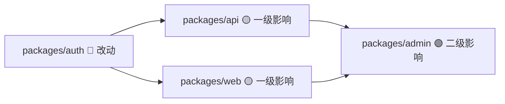
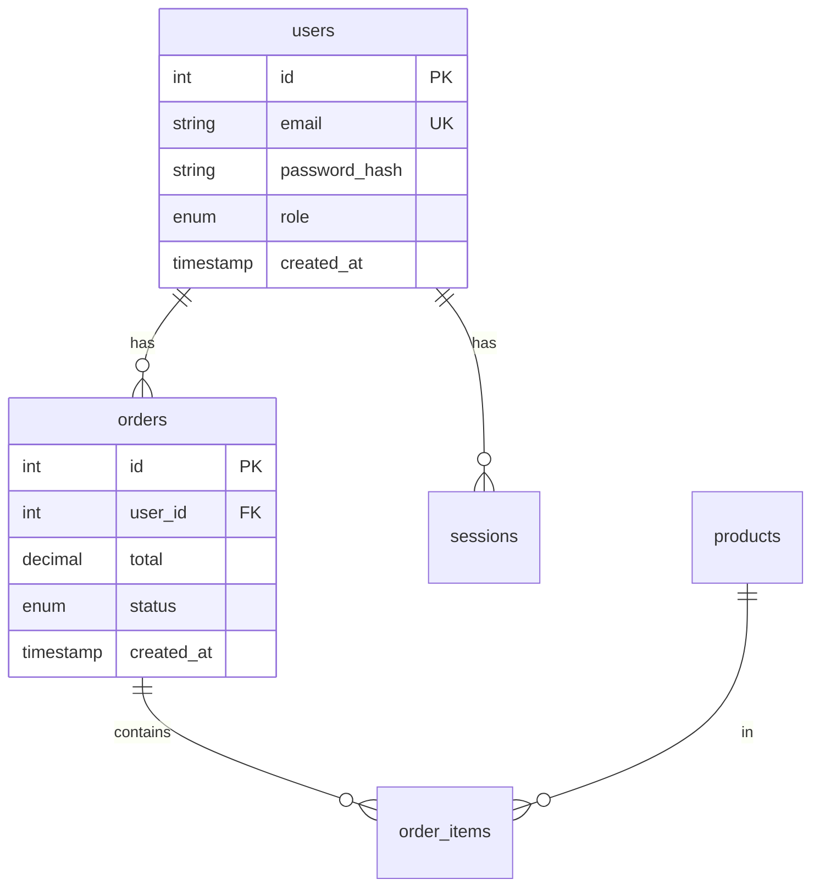

# Recipes R11-R15：团队与项目管理

## R11: 新人 Onboarding 文档生成（完整版）

### 完整输出模板

```markdown
为新加入的开发者生成 Onboarding 文档：

**自动分析项目并生成以下内容：**

# 🚀 新人 Onboarding Guide

## 1. 项目概述
（基于 README 和代码结构自动生成）
- 项目做什么
- 技术栈
- 核心架构（一段话）

## 2. 本地环境搭建
（基于 package.json / Dockerfile / .env.example 推导）

### 前置条件
- [ ] Node.js >= {版本}
- [ ] PostgreSQL >= {版本}
- [ ] Redis（如果项目用了的话）

### 步骤
```bash
git clone {repo}
cd {project}
cp .env.example .env.local  # 编辑填入实际值
npm install
npm run db:migrate
npm run dev
```

### 验证
- 打开 http://localhost:3000 看到首页
- 运行 `npm test` 全绿

## 3. 目录结构
（自动 ls 并注释每个目录的作用）

## 4. 关键概念
（从代码中提取核心模块的职责说明）

## 5. 常用命令
| 命令 | 作用 |
|------|------|
| `npm run dev` | 启动开发服务器 |
| `npm test` | 运行测试 |
| `npm run lint` | 代码检查 |
| `npm run build` | 构建生产版本 |
| `npm run db:migrate` | 执行数据库迁移 |

## 6. 代码约定
（从 .eslintrc / CLAUDE.md / .editorconfig 提取）

## 7. Git 工作流
（从 .github/ 和 branch 策略推导）

## 8. 常见问题 FAQ
（基于项目特点预判新人可能遇到的问题）

## 9. 联系人
（如果 CLAUDE.md 中有团队信息，提取出来）
```

---

## R12: 每周代码健康度报告（完整版）

### 完整执行流程

```markdown
生成本周代码健康度报告（{本周一} ~ {今天}）：

**数据采集**

1. Git 统计
   - git log --since="{周一}" --format="%an" | sort | uniq -c | sort -rn
   - git log --since="{周一}" --stat | tail -1
   - git log --since="{周一}" --oneline | wc -l

2. 测试健康度
   - npm test 2>&1 | tail -20
   - 如果有覆盖率报告：npm run test:coverage

3. 代码质量
   - npm run lint 2>&1 | grep -c "warning\|error"
   - 搜索新增的 TODO/FIXME：git diff HEAD~{本周commit数} --diff-filter=A | grep -i "todo\|fixme"

4. 依赖状态
   - npm audit --json | 统计漏洞数
   - npm outdated | 统计过期包数

**报告模板**

# 📊 周度代码健康度报告
## {周一} ~ {今天}

### 开发活跃度
| 开发者 | Commits | 增加行 | 删除行 |
|--------|---------|--------|--------|
| 张三 | 12 | +450 | -120 |
| ... | ... | ... | ... |
| **总计** | **32** | **+1,200** | **-340** |

### 测试状态
- 通过：142 ✅
- 失败：0
- 覆盖率：78.3%（上周：77.1% ↑1.2%）

### 代码质量
- Lint 警告：23（上周：28 ↓5）
- 新增 TODO：3
- 新增 FIXME：1

### 依赖健康
- 安全漏洞：0 Critical / 2 High / 5 Moderate
- 过期包：7（3 major / 2 minor / 2 patch）

### 趋势评估
🟢 整体趋势：改善
- 覆盖率持续提升
- lint 警告减少
- 无新增安全漏洞
```

---

## R13: Monorepo 影响分析（完整版）

```markdown
分析 $ARGUMENTS 的改动对 monorepo 其他包的影响：

**Step 1: 依赖图构建**
- 读取根 package.json 和每个 packages/*/package.json
- 构建包之间的依赖关系图

**Step 2: 影响传播分析**
- 从改动的文件确定属于哪个包
- 找出所有直接依赖这个包的包（一级影响）
- 找出间接依赖的包（二级影响）

**Step 3: 输出影响图**



**Step 4: 测试建议**
| 包 | 影响级别 | 需要的测试 |
|---|---------|-----------|
| packages/auth | 🔴 直接改动 | 全量测试 |
| packages/api | 🟡 一级依赖 | 集成测试 |
| packages/web | 🟡 一级依赖 | E2E 测试 |
| packages/admin | 🟢 二级依赖 | 冒烟测试 |

**Step 5: CI 优化建议**
最小测试集命令：
```bash
npx turbo test --filter=auth --filter=api --filter=web
```
```

---

## R14: Schema 文档自动生成（完整版）

```markdown
基于数据库 schema（Prisma/TypeORM/原始 SQL DDL），生成完整文档：

**输出 1: 表格文档**

# 数据库 Schema 文档

## users 表
| 列名 | 类型 | 约束 | 说明 |
|------|------|------|------|
| id | SERIAL | PK | 主键 |
| email | VARCHAR(255) | UNIQUE, NOT NULL | 邮箱 |
| password_hash | VARCHAR(255) | NOT NULL | bcrypt 哈希 |
| role | ENUM('admin','user') | DEFAULT 'user' | 角色 |
| created_at | TIMESTAMP | DEFAULT NOW() | 创建时间 |

索引：
- idx_users_email (email) - UNIQUE

**输出 2: ER 图**



**输出 3: 关系说明**
- users → orders: 一对多（一个用户可以有多个订单）
- orders → order_items: 一对多（一个订单可以有多个商品）
- products → order_items: 一对多（一个产品可以在多个订单中）
```

---

## R15: Cowork + MCP 联合工作流（完整版）

### 完整配置

```json
{
  "mcpServers": {
    "fetch": {
      "command": "npx",
      "args": ["-y", "@modelcontextprotocol/server-fetch"]
    },
    "filesystem": {
      "command": "npx",
      "args": ["-y", "@modelcontextprotocol/server-filesystem", "~/Research"]
    },
    "slack": {
      "command": "npx",
      "args": ["-y", "@mcp/server-slack"],
      "env": { "SLACK_BOT_TOKEN": "xoxb-..." }
    }
  }
}
```

### 完整执行步骤

```
竞品定价分析工作流：

1. 用 Fetch Server 获取以下竞品的定价页面：
   - competitor-a.com/pricing
   - competitor-b.com/pricing
   - competitor-c.com/pricing

2. 提取每个竞品的定价方案：
   - 方案名称
   - 月价/年价
   - 核心功能列表
   - 用户限制

3. 用 Filesystem Server 保存原始数据到 ~/Research/pricing-raw/

4. 生成对比分析：
   | 维度 | 我们 | 竞品A | 竞品B | 竞品C |
   |------|------|-------|-------|-------|
   | 基础方案 | $X | $Y | $Z | $W |
   | ... | ... | ... | ... | ... |

5. 用 Filesystem Server 保存分析报告到 ~/Research/pricing-analysis-{日期}.md

6. 用 Slack Server 将摘要发送到 #product 频道
```

### 预期 Slack 消息

```
📊 竞品定价分析更新 - 2026-04-26

关键发现：
• 竞品A 本月涨价 15%，基础方案从 $29 → $33
• 竞品B 新增企业方案，$199/月
• 我们的 Pro 方案性价比目前排名第 2

详细报告：~/Research/pricing-analysis-2026-04-26.md
```
