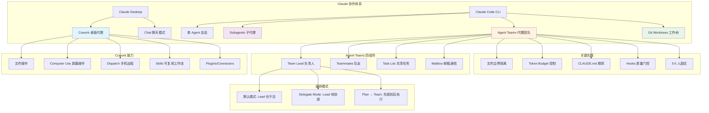
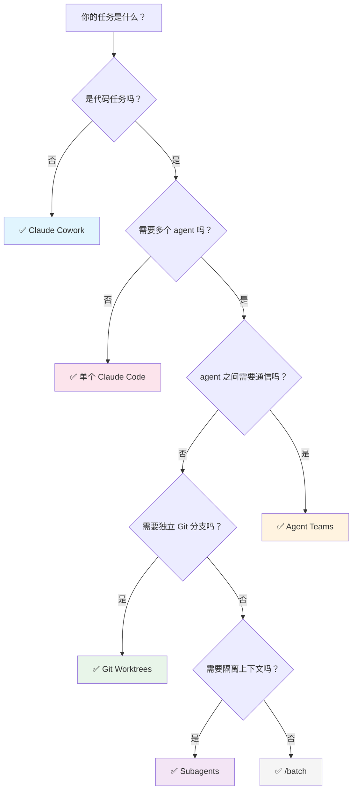
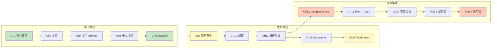

# 全书知识地图

## 概念关系图



## 工具选择决策树



## 难度层级路径



## 成本—能力矩阵

```
能力 ▲
     │
  高 │          ┌──────────┐
     │          │  Agent   │
     │          │  Teams   │
     │    ┌─────┤  (3-7x)  │
     │    │ Sub │          │
  中 │    │agents│──────────┘
     │    │(1.5-│
     │    │ 2x) │  ┌──────────┐
     │    └─────┘  │Worktrees │
  低 │  ┌──────┐   │  (Nx1x)  │
     │  │单agent│   └──────────┘
     │  │ (1x) │
     │  └──────┘
     └──────────────────────────► 成本
       低        中          高
```

## 章节—能力映射

| 你想学 | 读这些章 |
|--------|----------|
| 文件自动化 | Ch4, Ch5, Ch8 |
| 手机远程控制 | Ch6 |
| 屏幕自动化 | Ch7 |
| 多代理架构 | Ch9, Ch17 |
| 团队编排 | Ch11, Ch12, Ch13, Ch14 |
| 子代理并行 | Ch15 |
| Git 并行开发 | Ch16 |
| 真实案例 | Ch18, Ch19, Ch20, Ch21 |
| 成本优化 | Ch22, Ch23 |
| 质量保障 | Ch24, Ch26 |
| 社区工具 | Ch25 |
| 编程式构建 | Agent SDK 篇 |
